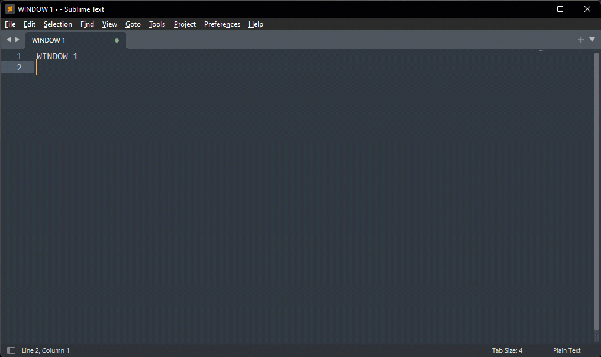

`AltBacktick` is a small Windows program that runs in background and allows to switch between windows of the same program using the keyboard shortcut `ALT`+`` ` ``.  

It's similar to [Easy Window Switcher](https://neosmart.net/EasySwitch/) but it supports more programs (for instance TablePlus), handles minimized windows and is open source.

*The key `` ` `` (`backtick`) is above the `TAB` key on QWERTY keyboard but even if your keyboard is not QWERTY, the shortcut will be mapped to the key above the `TAB` key.*

### Usage

#### Installing

1. Download the last executable from [GitHub](https://github.com/akiver/AltBacktick/releases) or clone the repository and build it from Visual Studio
2. Run the program
3. Click on `Automatically start AltBacktick` (or `Run AltBacktick without installing` if you only want to run it)

#### Uninstalling

1. Run the program
2. Select `Uninstall AltBacktick`

### License

[GPL v2](https://github.com/akiver/AltBacktick/blob/master/LICENSE)
